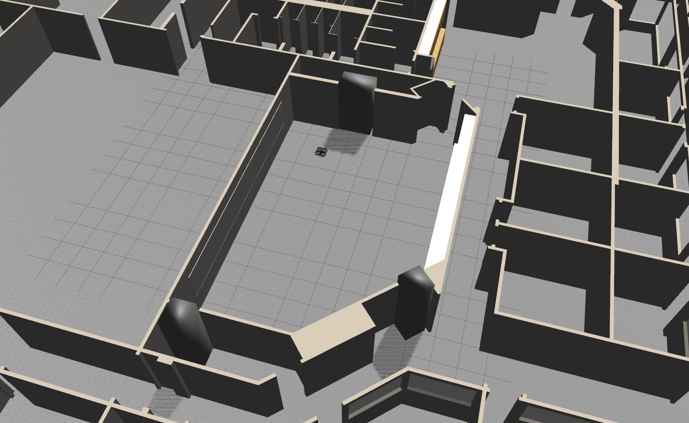

# subsumption

ardroneをルンバのように動かすための開発リポジトリ


ardroneのシミュレータ環境関係一式はここから
@[ardrone](https://github.com/lancer-evolution/ardrone)

## execution

ps3コントローラ及び、前方の回避行動
```bash
roslaunch subsumption ardrone_world.launch
rosrun joy joy_node
rosrun subsumtion psd
```

自動で動きまわる用
```bash
roslaunch subsumption ardrone_world.launch
rosrun subsumtion psd_auto
```

## detailes

* psd
ps3を用いてdroneをコントロールでき、前方に障害物が存在した場合、強制backする。

* psd_auto
droneがルンバのように自動で動き回る。
現時点では、前方に進み障害物があれば後退し、回転した後またまた前進する。